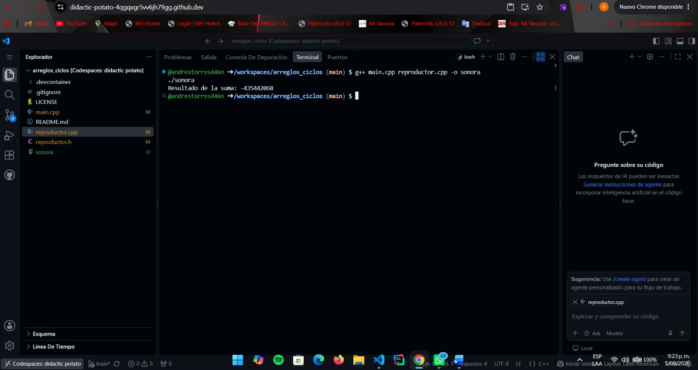

### Bitácora de errores, Andrés Felipe Torres Lozano

### Error 1
*Captura:* 
*Qué esperaba:* Obtener la suma correcta de las 7 posiciones (117100).
*Qué pasó:* El programa corrió, pero el resultado fue un número incorrecto e inconsistente.
*Qué lo arregló:* Inicialicé la variable total a 0 en la función sumar_reproducciones_semana.

### Error 2
*Captura:* [captura2.png]
*Qué esperaba:* Obtener porcentajes con decimales (ej. 10.2477%).
*Qué pasó:* El programa compiló y mostró porcentajes enteros (ej. 10%), perdiendo la precisión.
*Qué lo arregló:* Cambié el tipo del arreglo porcentajes de int a double y usé 100.0 en el cálculo.

### Error 3
*Captura:* [captura3.png]
*Qué esperaba:* Obtener 4 días que superan el umbral de 15000.
*Qué pasó:* El programa devolvió 7, contando todos los días sin importar el umbral.
*Qué lo arregló:* Corregí la condición del if para comparar reproducciones_semana[dia] > umbral.

### Error 4
*Captura:* [captura4.png]
*Qué esperaba:* El ciclo for recorriera el arreglo sin problemas.
*Qué pasó:* El compilador mostró: error: ‘begin’ was not declared in this scope.
*Qué lo arregló:* Cambié el ciclo for (int valor : arreglo) por for (int i = 0; i < 7; i++).

### Error 5
*Captura:* [captura5.png]
*Qué esperaba:* Que el menú de Sonora compilara y la opción 6 mostrara las reproducciones semanales.
*Qué pasó:* El enlazador mostró un error undefined reference porque la función estaba implementada en .cpp pero no declarada en .h.
*Qué lo arregló:* Por alguna razon la función mostrar_reproducciones_semana estaba comentada en reproductor.h, la descomente y listo.

### Lo que aprendí
1. Aprendí que la diferencia entre int y double es crucial al hacer divisiones, y que el compilador no siempre te avisará si estás perdiendo precisión.
2. Entendí la diferencia entre un error de compilación y un error de enlazado, y cómo la estructura de archivos .h y .cpp afecta esto.
3. Me di cuenta de que siempre debo inicializar mis variables acumuladoras, ya que su valor inicial puede ser cualquier cosa y llevar a resultados incorrectos sin que el programa falle.
